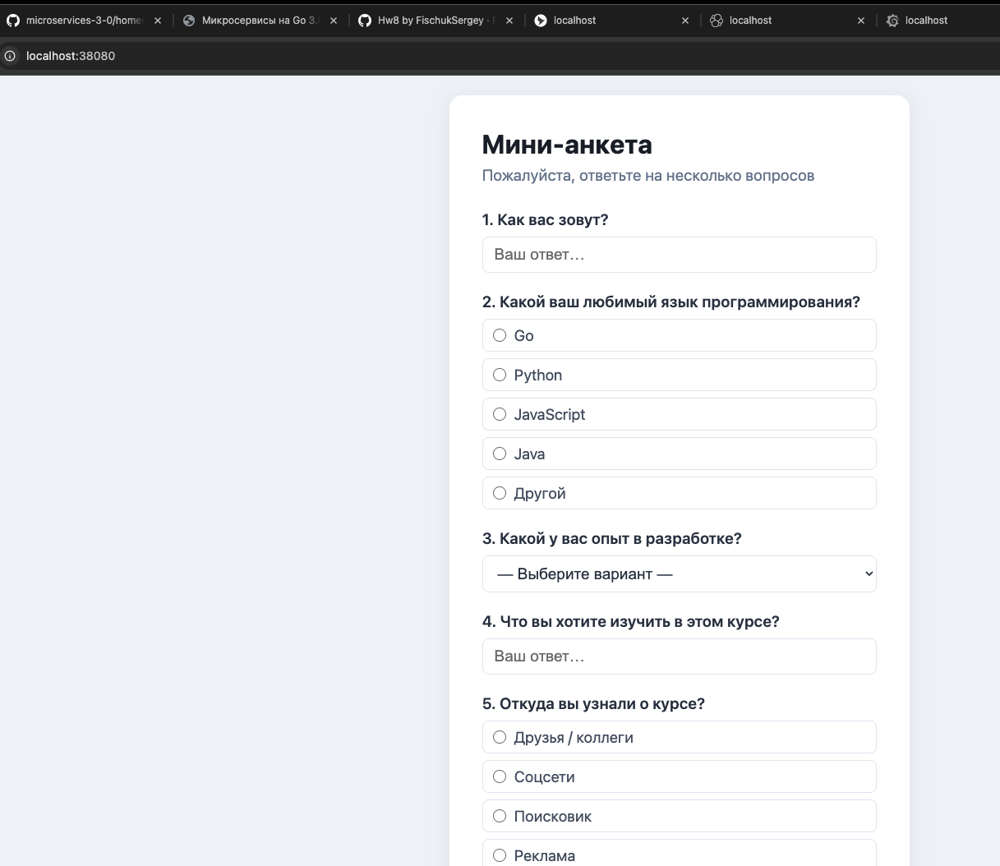
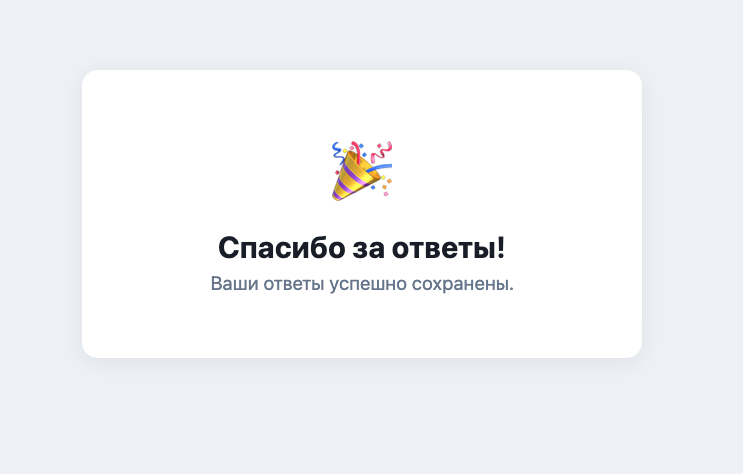

# Мини-анкета

Full-stack приложение «Мини-анкета» на Go + HTML/JS.  
Домашнее задание курса OtusAI · HW1.

## Описание

Приложение позволяет пройти небольшую анкету прямо в браузере:

- Backend на Go предоставляет REST API
- Frontend — одна HTML-страница с динамической формой
- Ответы хранятся в памяти сервера

## Быстрый старт (Docker)

**Требования:** [Docker](https://docs.docker.com/get-docker/) и Docker Compose v2

```bash
# 1. Клонировать репозиторий
git clone https://github.com/sergeymac/otusai-hw1.git
cd otusai-hw1

# 2. Собрать и запустить контейнер
docker compose up --build

# 3. Открыть в браузере
open http://localhost:8080
```

Остановить: `Ctrl+C`, затем `docker compose down`

## Запуск без Docker (локально)

**Требования:** Go 1.26+

```bash
cd backend
go run main.go
# Сервер запустится на http://localhost:8080
```

> Frontend автоматически раздаётся по адресу `http://localhost:8080`

Изменить порт:
```bash
PORT=3000 go run main.go
```

## API

| Метод | Путь         | Описание                              |
|-------|--------------|---------------------------------------|
| GET   | `/questions` | Список вопросов анкеты (JSON)         |
| POST  | `/answers`   | Сохранить ответы пользователя (JSON)  |

### GET /questions

```bash
curl http://localhost:8080/questions
```

Пример ответа:
```json
[
  { "id": 1, "text": "Как вас зовут?", "type": "text" },
  { "id": 2, "text": "Какой ваш любимый язык программирования?", "type": "radio",
    "options": ["Go", "Python", "JavaScript", "Java", "Другой"] }
]
```

### POST /answers

```bash
curl -X POST http://localhost:8080/answers \
  -H "Content-Type: application/json" \
  -d '{"answers": [{"question_id": 1, "value": "Иван"}, {"question_id": 2, "value": "Go"}]}'
```

Пример ответа:
```json
{ "status": "ok" }
```

## Структура проекта

```
.
├── backend/
│   ├── main.go          # HTTP-сервер (Go)
│   └── go.mod
├── frontend/
│   └── index.html       # SPA (HTML + CSS + JS)
├── screenshots/         # Скриншоты работы
├── Dockerfile           # Multi-stage сборка
├── docker-compose.yml
├── PLAN.md              # План реализации
├── CHECKLIST.md         # Чек-лист выполнения
└── PROMPTS.md           # Использованные промты
```

## Скриншоты

| Форма анкеты | Сообщение «Спасибо» |
|---|---|
|  |  |
